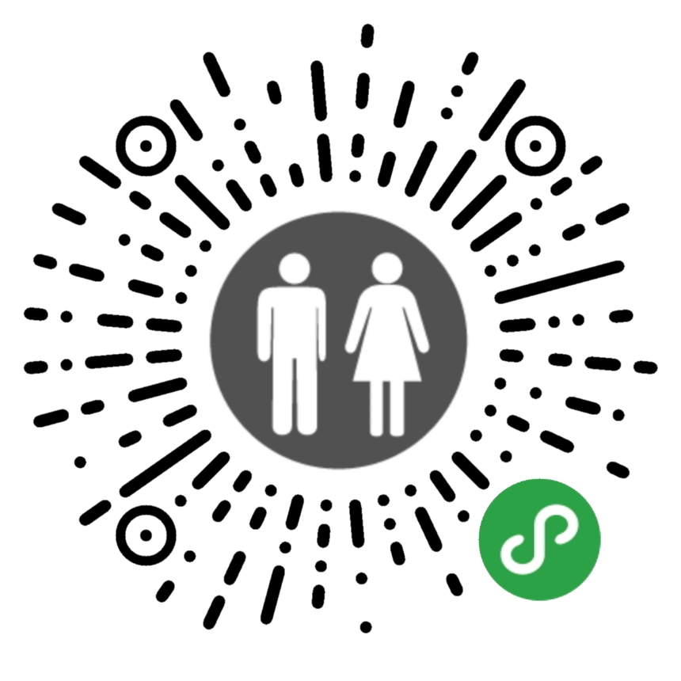
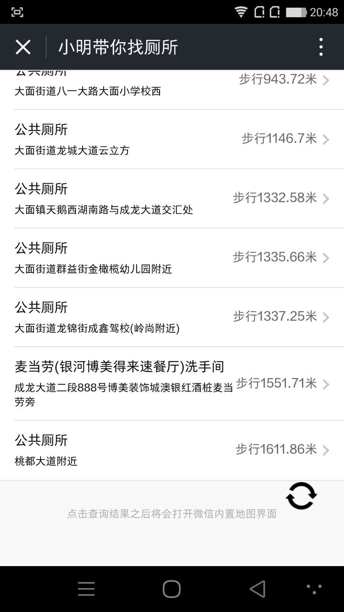
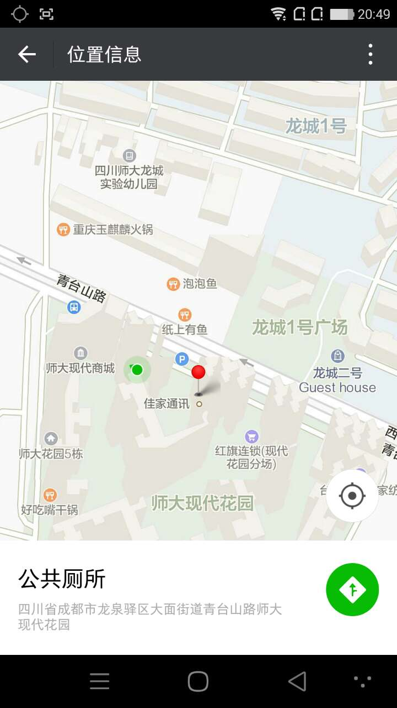
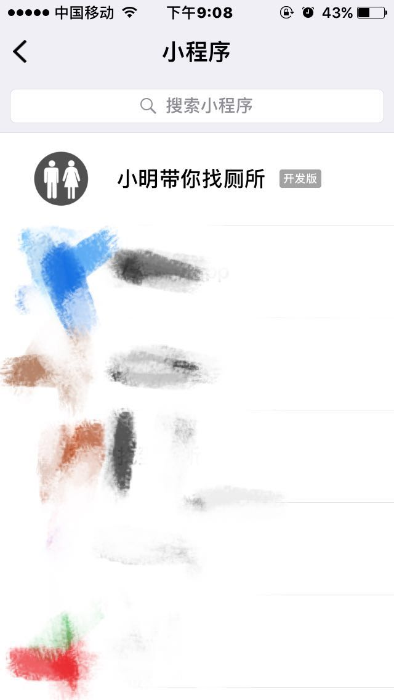
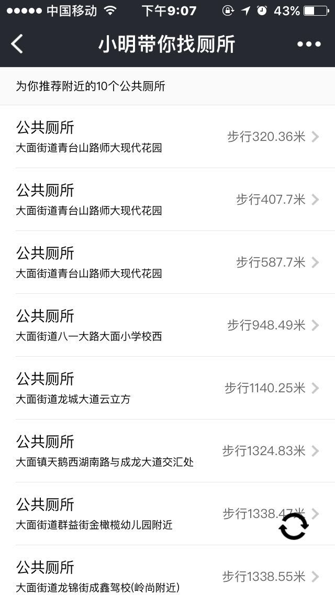
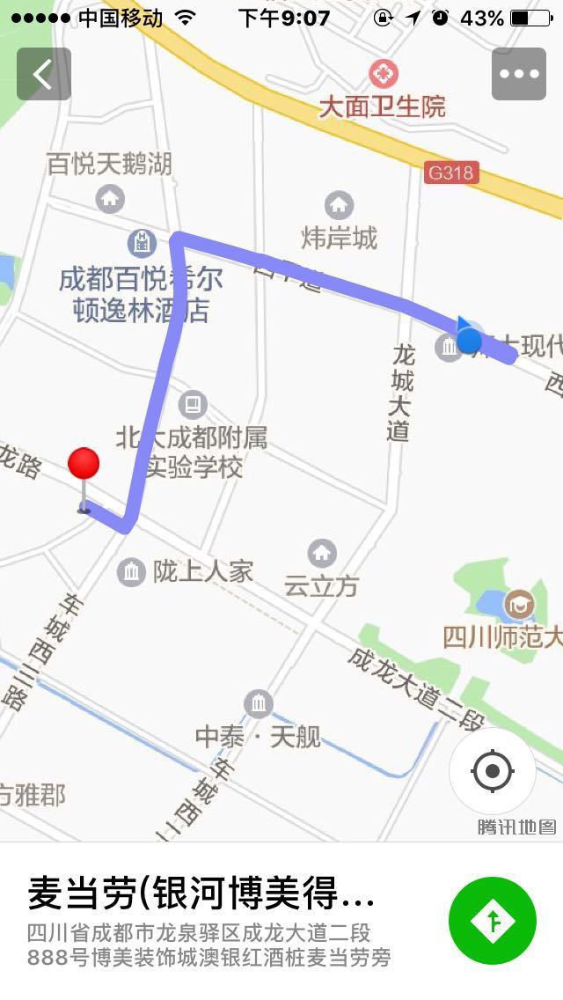
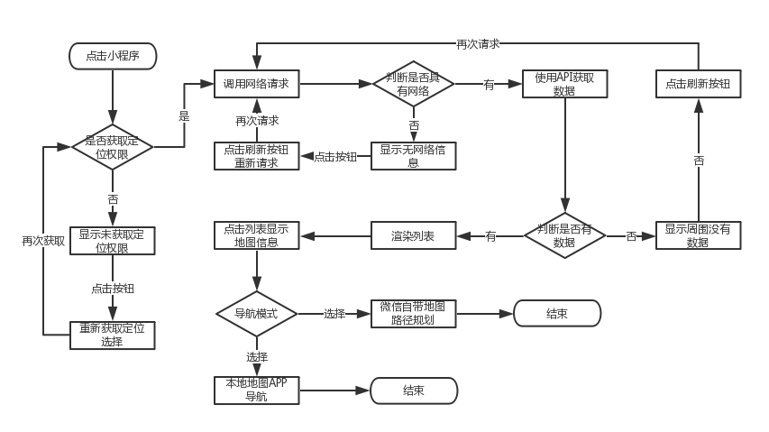
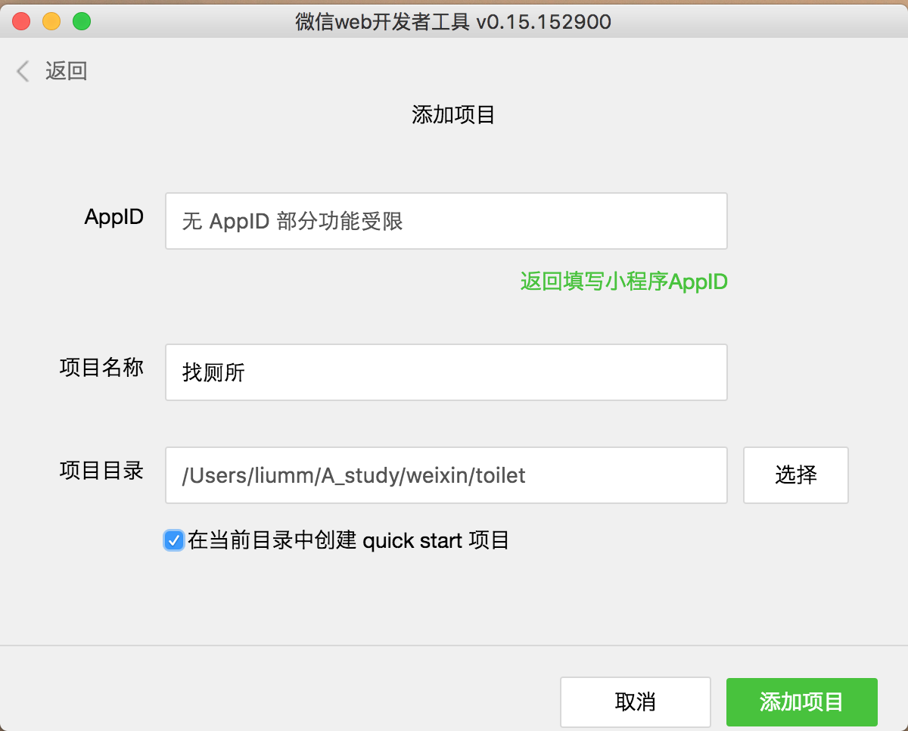
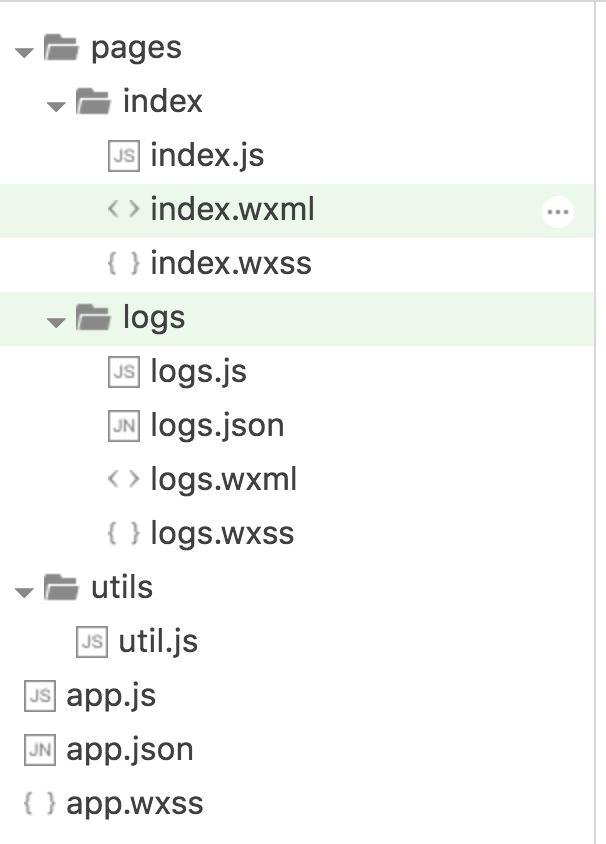
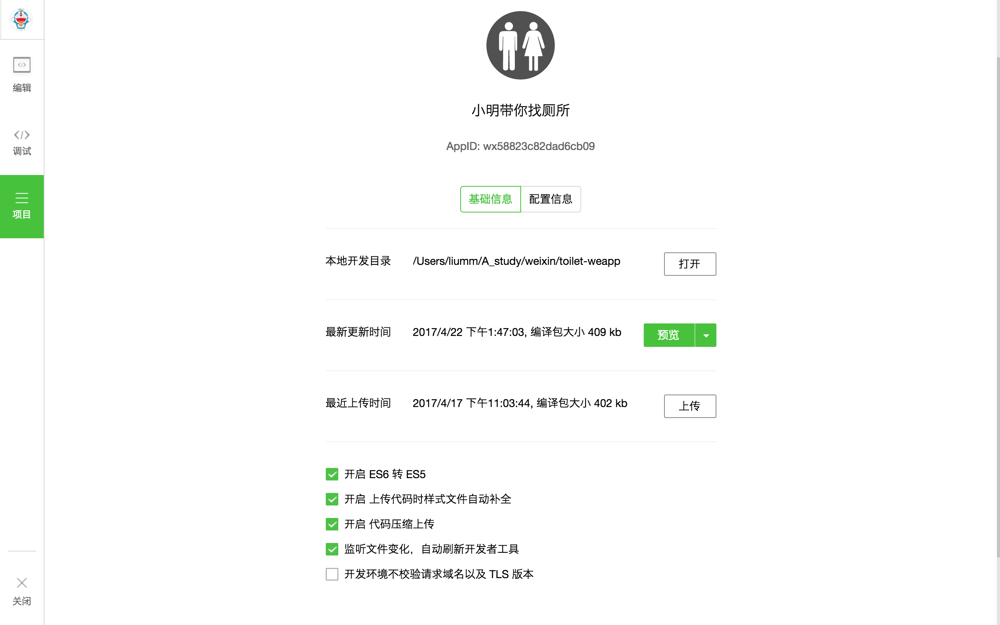

## 微信小程序找厕所（小明带你找厕所）
[](https://github.com/feross/standard)

先不废话，直接扫描体验



## 预览


## 1 需求梳理
### 1.1 前言
在去年的时候、已经使用react-native开发过找厕所APP <https://github.com/liumingmusic/react-native-full-example>，在这里也要感谢vczero的react-native相关课程和书籍的支持，才完成APP开发。今天年初微信发布了小程序，以简约方便体验走进了人们的视线，作为一款功能简单，使用频率低的APP是一种很大的冲击，虽然现在小程序以功能的不健全，不像刚刚发布时那么火，但是它的无需下载、无需安装，体验方便也是一种优势，所以对于之前开发的找厕所APP，打算开发出一款对应功能的小程序，方便以后生活使用。

### 1.2 功能需求
**V1.0 版本**
- [x] 打开直接定位
- [x] 厕所信息已列表方式进行展示，按当前定位点最近进行排序
- [x] 默认显示1000内最多是个公共厕所
- [x] 列表显示厕所名称、位置信息和步行距离
- [x] 列表页面具有刷新功能，以避免网络延迟，获取不到数据
- [x] 显示列表进行点直接打开微信自带地图，可以根据选择是否显示路线和打开本地地图APP进行导航

**V2.0 版本**
- [ ] 可以在地图上面展示所有厕所的位置，并且标记
- [ ] 直接在小程序端进行路径规划，ios和android一样
- [ ] 默认选择步行方式
- [ ] 制作关于界面

## 2 设计阶段
 

## 3 开发前环境搭建
### 3.1 小程序编辑器下载
工欲善其事必先利其器，首先肯定是下载[小程序开发的编辑器](https://mp.weixin.qq.com/debug/wxadoc/dev/devtools/download.html)，安装完成，最后在微信公众平台注册开发的小程序，获取相关的keyId(如果没有，开发时有些功能无法使用)。**最后建议，把小程序的文档说明看一遍，大致有个印象**，如果你本来就学过react、vue等相关mvvm前端框架，那么学起来更快。

### 3.2 创建项目、快速开发
打开开发工具，填写相关的信息，建议勾选上quick start，他将会生成基本的页面模板。
<div  align="center">   

</div>

之后创建项目，就会生成基本的页面模板
<div  align="center">   

</div>

## 4 项目结构组织
```
├── images                              //项目用到的图片资源                                   
├── pages                               //页面结构
│   ├── index                           //主页面结构 显示列表信息
│   │   ├── index.js                    
│   │   ├── index.json                            
│   │   ├── index.wxml                          
│   │   └── index.wxss    
│   ├── location                        //信息在地图上撒点      
│   │   ├── location.js                              
│   │   ├── location.json                            
│   │   ├── location.wxml                          
│   │   └── location.wxss 
│   ├── about                           //小程序关于界面
│   │   ├── about.js                              
│   │   ├── about.json                            
│   │   ├── about.wxml                          
│   │   └── about.wxss                          
├── readme                              //编写readme需要的相关资源图片          
├── resource                            //第三方资源包
│   ├── lib        
│   ├── map                              
├── utils                               //工具类方法       
├── app.js                              
├── app.json     
├── app.wxss     
├── README.md                              
```
## 5 开发阶段
逻辑不是很难(参看源码即可)，只需要考虑到没有权限、没有网络和没有数据的页面显示情况的特殊处理。这里需要提醒的是，数据来源是腾讯提供的周围搜索，所以需要在**小程序中绑定请求的url**，然后在编辑器项目选项配置中刷新按钮，调试才会正常请求。如果自己开发接口进行访问，一定要是**https**协议。

## 6 预览、上传、审核
在编辑器左边的项目按钮，可以对正在开发的项目进行预览，这样就可以边开发边调试。
<div  align="center">   

</div>

之后开发完成可以进行上传，在小程序开发管理界面可以选择刚提交上来的项目作为体验版本，先让周围的朋友进体验下测试。注意，选了体验版本之后还需要在用户身份界面绑定体验者(可以绑定十个体验者)。如果在体验的过程发现bug，还可以进行修改，毕竟还没有上线。

## 7 发布
经过体验之后，发现bug可以进行修改反复步骤，待问题全部解决，最后就可以上线了。点击按钮可以进行审核(我这个需要了两天)，通过之后你绑定的微信为推送消息提醒你，审核通过不代表就发布了，需要自己登陆管理平台，手动将审核通过小程序进行发布。发布之后由于网络原因，可能会出现一定的延迟，在小程序中搜索不到发布的信息，耐心等待，过一会就好了。

## 8 总结
总的来说，开发不难，特别是对于已经熟悉react、vue、angular的语法同学们。在开发之前先把官网的介绍看看，开发文档过一遍，大致有个印象。然后在网上找找与小程序相关的ui框架，结合使用，让后看看腾讯或者高德关于小程序的地图API文档。

现在的功能是有点简单，但是已经够满足实际使用，后续有空也将会进行功能完善。

## 项目打赏
需要联合开发小伙伴也可以发邮件给我说，还有如果您觉得我的案例能帮助到您，您可以打赏作者一瓶汽水 

